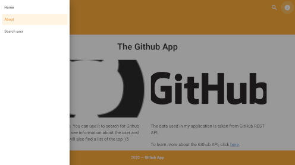

<!-- PROJECT LOGO -->
<br />
<p align="center">
  <a href="https://github.com/mateuszlubianka1993/github-app">
    
  </a>

  <h3 align="center">Github App Vue</h3>

  <p align="center">
    Simple Github App.
    <br />
    <br />
    <a href="https://github-app-vue.netlify.app/">View Demo</a>
  </p>
</p>


<!-- TABLE OF CONTENTS -->
## Table of Contents

* [About the Project](#about-the-project)
  * [Built With](#built-with)
* [Usage](#usage)
* [Screens](#screens)
* [Getting Started](#getting-started)
  * [Prerequisites](#prerequisites)
  * [Installation](#installation)
* [Contact](#contact)


<!-- ABOUT THE PROJECT -->
## About The Project

This is Github App. On home page you can find a list of the first 15 organizations. You can also earch for Github user profiles. You can see information about the user and his repositories.
**Scroll down to get more info**

### Built With

* Vue.js
* Html
* CSS
* Java Script
* vuex
* axios
* vue-router
* Vuetify
* vue-scrollto
* Github API
* husky

## Usage


## Screens




<!-- GETTING STARTED -->
## Getting Started

To get a local copy up and running follow these simple steps.

### Prerequisites

This is an example of how to list things you need to use the software and how to install them.
* npm
```sh
npm install npm@latest -g
```

### Installation
 
1. Clone the repo
```sh
git clone https://github.com/mateuszlubianka1993/github-app
```
2. Install NPM packages
```sh
npm install
```
3. Compiles and hot-reloads for development
```sh
npm run serve
```
4. Compiles and minifies for production
```sh
npm run build
```
5. Lints and fixes files
```sh
npm run lint
```


<!-- CONTACT -->
## Contact

* Project Link: [https://github.com/mateuszlubianka1993/github-app](https://github.com/mateuszlubianka1993/github-app)
* Live Demo: [https://github-app-vue.netlify.app/](https://github-app-vue.netlify.app/)
